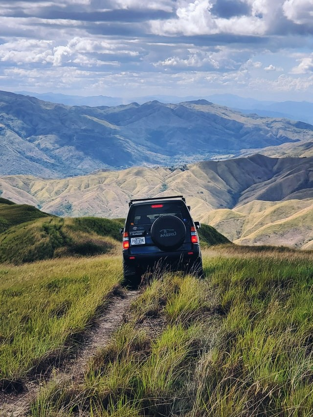
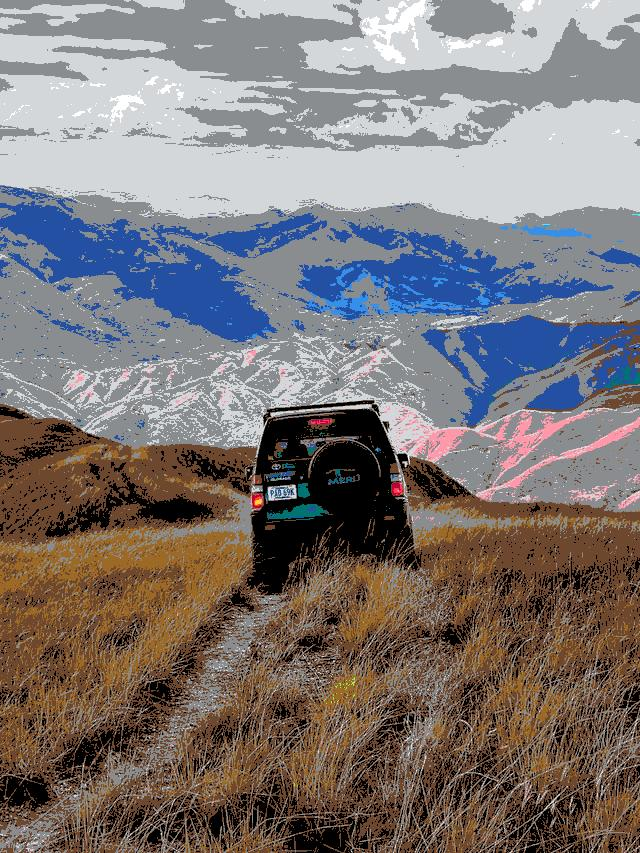
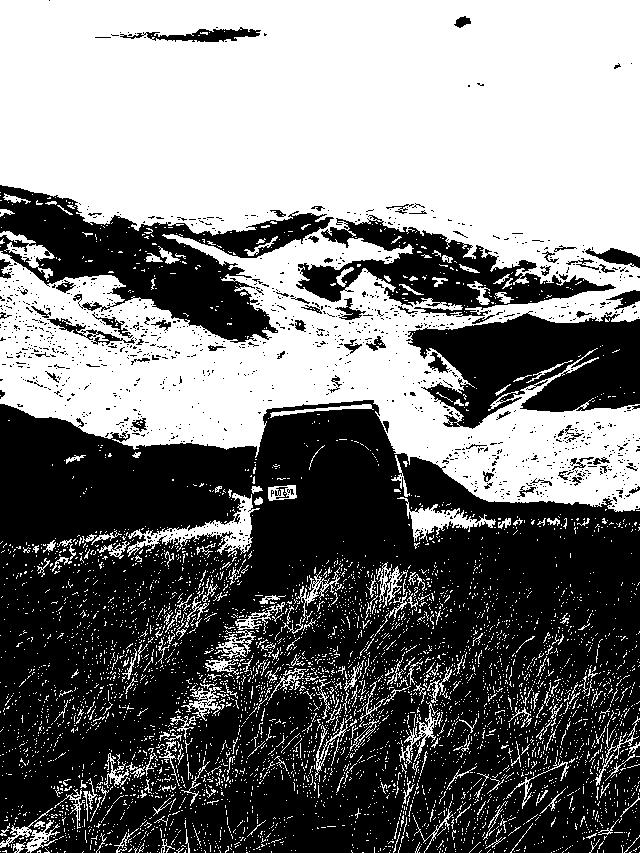
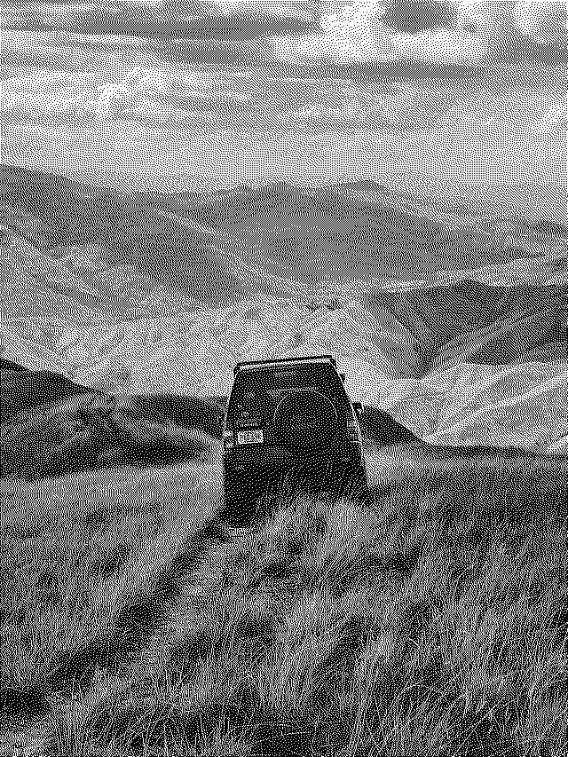
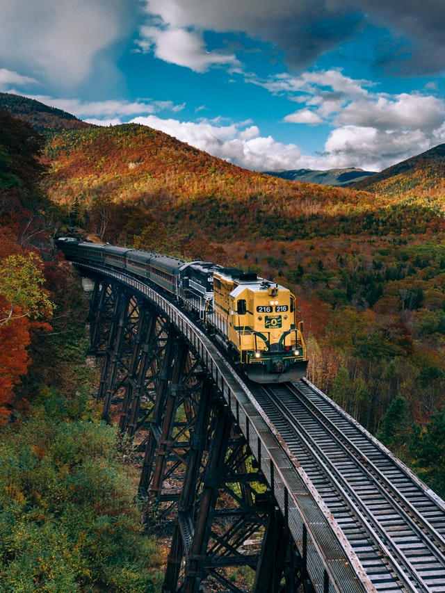
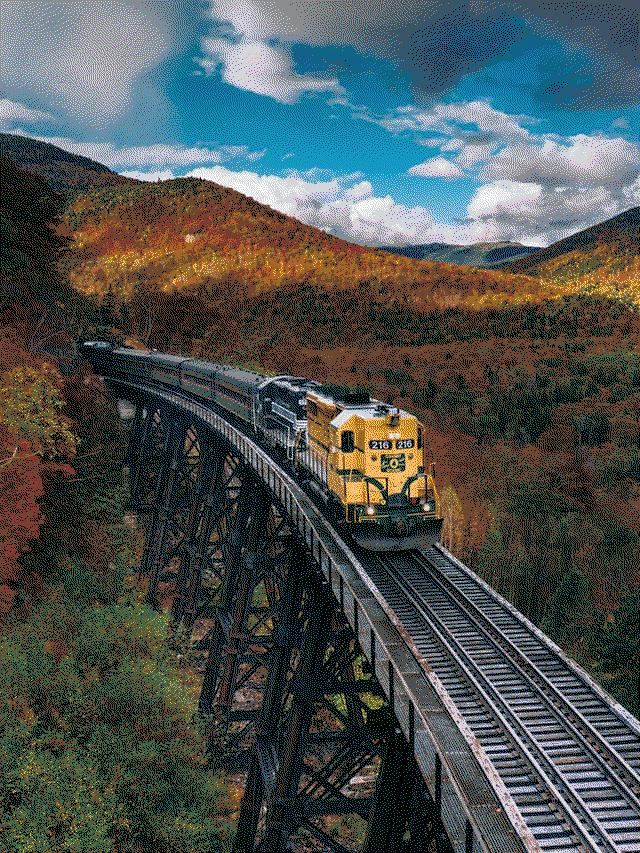
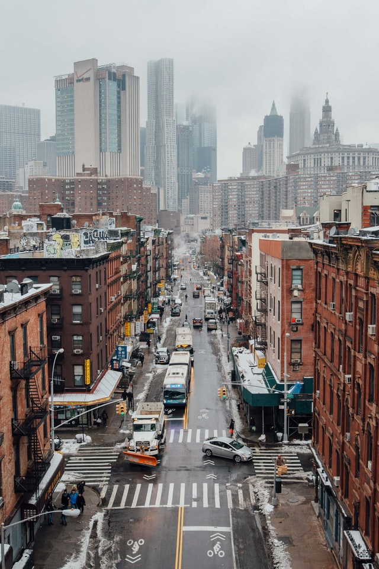
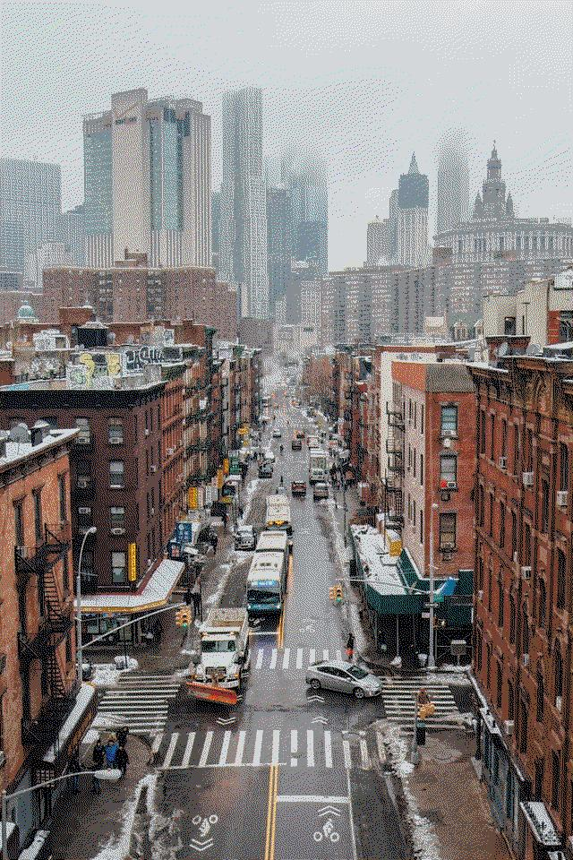
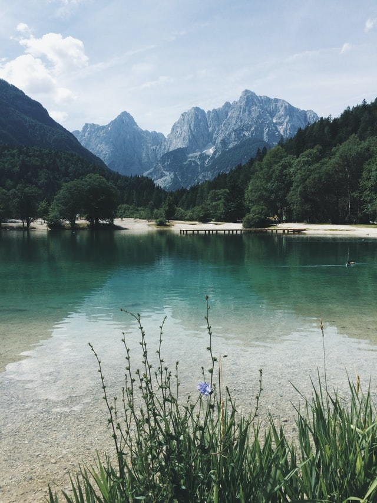
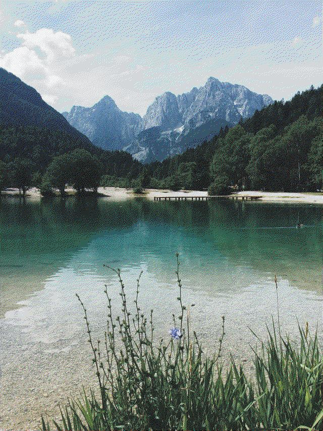

# image-dithering
 
A script to apply color restriction to images. Uses the Floyd-Steinberg dithering algorithm.

## Usage

To process an image:

```
$ python color-restriction.py .\images\car.jpg --pallete Reddit
```

To apply color restriction without dithering:

```
$ python color-restriction.py .\images\car.jpg --pallete Reddit --no-dithering
```

## Examples

Color pallete restriction with dithering:

| Original image | With dithering |
|-----------------------------------|--------------------------------|
|  | 


Color pallete restriction without dithering:

| Original image | Without dithering |
|-----------------------------------|--------------------------------|
|  |  |


Color restriction to black and white:

| Without dithering | With dithering |
|-----------------------------------|--------------------------------|
|  |  |


Other samples:

| Original image | With dithering |
|-----------------------------------|--------------------------------|
|  |  |
|  |  |
|  |  |

More in the `examples/` folder.